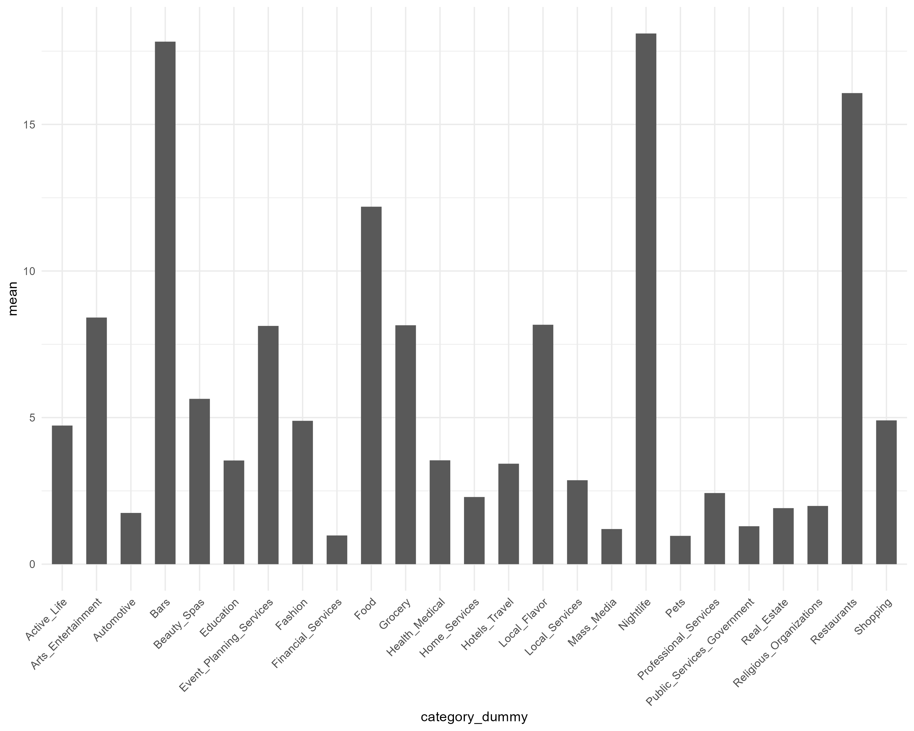

```{r setup, include=FALSE}
knitr::opts_chunk$set(echo = TRUE)
```

### Tabula Statement

We're part of an academic community at Warwick.

Whether studying, teaching, or researching, we’re all taking part in an expert conversation which must meet standards of academic integrity. When we all meet these standards, we can take pride in our own academic achievements, as individuals and as an academic community.

Academic integrity means committing to honesty in academic work, giving credit where we've used others' ideas and being proud of our own achievements.

In submitting my work I confirm that:

1. I have read the guidance on academic integrity provided in the Student Handbook and understand the University regulations in relation to Academic Integrity. I am aware of the potential consequences of Academic Misconduct.

2. I declare that the work is all my own, except where I have stated otherwise.

3. No substantial part(s) of the work submitted here has also been submitted by me in other credit bearing assessments courses of study (other than in certain cases of a resubmission of a piece of work), and I acknowledge that if this has been done this may lead to an appropriate sanction.

4. Where a generative Artificial Intelligence such as ChatGPT has been used I confirm I have abided by both the University guidance and specific requirements as set out in the Student Handbook and the Assessment brief. I have clearly acknowledged the use of any generative Artificial Intelligence in my submission, my reasoning for using it and which generative AI (or AIs) I have used. Except where indicated the work is otherwise entirely my own.

5. I understand that should this piece of work raise concerns requiring investigation in relation to any of points above, it is possible that other work I have submitted for assessment will be checked, even if marks (provisional or confirmed) have been published.

6. Where a proof-reader, paid or unpaid was used, I confirm that the proofreader was made aware of and has complied with the University’s proofreading policy.

7. I consent that my work may be submitted to Turnitin or other analytical technology. I understand the use of this service (or similar), along with other methods of maintaining the integrity of the academic process, will help the University uphold academic standards and assessment fairness.

### Privacy Statement

The data on this form relates to your submission of coursework. The date and time of your submission, your identity, and the work you have submitted will be stored. We will only use this data to administer and record your coursework submission.

### Related Articles

- [Reg. 11 Academic Integrity (from 4 Oct 2021)](https://warwick.ac.uk/services/aro/dar/quality/categories/examinations/regulations/cheating)
- [Guidance on Regulation 11](https://warwick.ac.uk/services/aro/dar/quality/categories/examinations/regulations/cheating/guidance)
- [Proofreading Policy](https://warwick.ac.uk/services/aro/dar/quality/categories/proofreading)
- [Education Policy and Quality Team](https://warwick.ac.uk/services/aro/dar/quality)
- [Academic Integrity (warwick.ac.uk)](https://warwick.ac.uk/services/aro/dar/quality/categories/examinations/academicintegrity)

This is the end of the statement to be included.  


## Introduction
For this project, I chose John Rollins’ methodology for its flexible, iterative nature due to challenges in data wrangling, comprehensiveness in analysis and agility in implementation, making it suitable for a big data analysis such as this. This methodology emphasizes an iterative process through phases including data understanding, preparation, modelling, evaluation, and deployment. I began with data understanding as the data was already available and iterated continuously between data preparation and understanding until I was satisfied with my data before modelling. However, I encountered several challenges while modelling such as running out of RAM to compute my desired models, possible collinear variables requiring feature refinement and this methodology allowed me to iterate between phases multiple times till my desired model was achieved.  

## Most difficult challenge in assignment
The most challenging aspect of this project was deciding how to wrangle the business dataset, engineer features, and extract the most relevant information in predicting stars with relatively simple models as taught in class. The business dataset has 39 mostly unfilled attributes and the many attributes that were hard to transform meaningfully for fitting models such as ambience and the unreliable information made usefulness in analysing individual attributes limited.  

To solve this issue, the total number of non-empty attributes for every business was summed up and named the variable “engagement”. The more attributes a business fills out, even if the response is none, the more likely a business is to be engaged on Yelp and other platforms, the more likely their proactiveness to maintain a digital presence and outreach. These businesses are also more likely to strive for better reviews on Yelp and could be another feature for predicting stars. This was a feasible way I found to extract information out of attributes I wouldn’t otherwise be able to.

## Data Understanding and Variable Selection
I began data wrangling with user data to extract useful user features which may aid in review prediction. I started with finding user account age in years, and calculated “friend_count” and “elite_year_count” by parsing the columns. I included other user features like average stars, total fans, total useful, funny, and cool sent by users and all the compliments received by users. I believe these features would show how active a user might be and would help in review prediction. I also included the user tip count extracted from tip data as another feature for a user’s proactiveness on yelp.  

In addition to the aforementioned challenges in business data wrangling, I found 1,312 unique business categories, simply too many to include all as features. I originally parsed the categories for main categories found on Yelp’s site but refined it further by identifying important categories by considering engagement, as a generally more engaged business category's dummy would likely improve prediction accuracy for reasons stated. I plotted the engagement means of each major category while including minor categories I found the highest engagement means for when examining data. Bars and grocery appear to be the strongest minor categories as I examined the data, so I included them in the plot, which suggests my suspicions were correct. Transforming business hours for use also proved challenging as I found 23,223 businesses with no information while some businesses only have hours listed for less than 2 days a week, often a temporary measure after checking on Yelp. I decided to omit “is open” and opening hours as I believe they are both weak and noisy predictors while the data is unreliable for hours. I also collected the check-in and tip counts a business received as another feature of how popular the business may be. I included latitude, longitude, and state data as geographical features, but omitted cities for two reasons, as there would be over 1000 levels which R cannot handle and would likely also overfit the model.  
  
  
  

Finally, I included review age, and ratings a review received for my model. I used the smaller dataset of 1.4 million observations instead as I could not train a Random Forests model otherwise due to RAM limitations.

  
  
## Models’ Training and Analysis:
As review stars are discrete outcomes, I believe a tree model would be suitable for this classification. However, individual decision trees are not robust enough as a small change in data could significantly change predictions. Bagging alleviates this by growing many trees while randomly sampling the training data with replacement and taking the averages of trees’ predictions, however there is still correlation between trees predictions so there is a limit in gains in robustness through bagging. Random forest addresses this through also sub-setting variables randomly for every split in every tree on top of bagging, which should reduce the correlation in predictions across the tree ensemble. Overall, I believe Random Forest would be most robust and suited for this project, even with interpretability trade-offs compared to linear models. Nonetheless, I started with fitting other models for more information on my selected features. I found that my cross-validated LASSO model performed variable selection for only one variable but after scaling, LASSO performed variable selection for most features, Ridge also shows a few features dominating in predictive power. 
```{r}
library(knitr)
load("C:/Users/Travis Tan/OneDrive - University of Warwick/EC349/R projects/EC349-Assignment/scaled Ridge coefficients.Rdata")
kable(coef.scaled.ridge.df)
```

```{r}
library(knitr)
load("C:/Users/Travis Tan/OneDrive - University of Warwick/EC349/R projects/EC349-Assignment/scaled LASSO coefficients.Rdata")
kable(coef.scaled.lasso.df)
```

This implies that roughly 25% of variables have disproportionate predictive power and Random Forest may not be suitable as its main weakness is poor performance when variable size is large but only a small number of variables are relevant. This also implies that random forest's advantage over bagging may be ambiguous since Random Forest usually outperform bagging through eliminating correlation between trees by sub-setting variables when growing trees. If only a few variables are relevant, Random Forest is likely to subset irrelevant features when growing trees whereas in bagging, there's a consistent chance that these relevant features would be used to grow trees since bagging does not subset features.  

While a boosting model such as AdaBoost was an option, I chose Random Forest for its robustness to overfitting given my large feature set as Random Forest’s averaging is less sensitive to noise and outliers in the data compared to boosting which continuously corrects previous mistakes. Random Forest is also simpler to tune compared to boosting as boosting would require tuning the weights of predictors averaged and the number of estimators predicted.  

After estimating the models, Random Forest was confirmed to be the best performing model even compared to boosting, with a 200-tree-forest generating a out-of-sample mean error rate of 0.4007445, meaning Random Forest outputs correct predictions approximately 60% of the time. This is compared to error rates of 0.4803091 for bagging and 0.4529025 for AdaBoost, validating my suspicions though I did not tune any of these models and used the packages' stock settings. My analysis found diminishing gains in accuracy in increasing number of trees for bagging and random forest or stumps for AdaBoost beyond 100 trees or stumps as expected.  

## Conclusion

Although Random Forest outperformed boosting in my analysis, boosting or a neural network could outperform Random Forest through careful tuning as learning models benefit greatly from sophisticated tuning. Given some features have disproportionate predictive power, trimming features may improve Random Forest performance. While using a bigger dataset may bring prediction improvements, I believe the dataset is sufficiently big and any accuracy gains would be minimal. I was unable to also implement a multinomial logistic model with LASSO due to time constraints, but I doubt accuracy gains would be significant given the assumption of linearity although the increased interpretability could make it superior to random forest if performances are similar.    

  
Link to GitHub project : https://github.com/TTravis67/EC349-Assignment  


